# Building a Complete Embedded System

## Objectives

After completing this lab, you will be able to:

* Create an embedded system design using Vivado and SDK flow
* Configure the Processing System (PS)
* Add Xilinx standard IP in the Programmable Logic (PL) section
* Use SDK to build a software project and verify the design functionality in hardware.

## Steps

## Create a Vivado Project
### Launch Vivado and create an empty project targeting the ZCU106 board, selecting Verilog as a target language
1. Open Vivado by selecting **Start &gt; All Programs &gt;**  **Xilinx Design Tools**  **&gt; Vivado 2018.2 &gt; Vivado 2018.2**
2. Click **Create Project** to start the wizard. You will see the _Create A New Vivado Project_ wizard page. Click **Next**.
3. Click the Browse button of the _Project Location_ field of the **New Project** form, browse to **{labs}** , and click **Select**.
4. Enter **lab1** in the _Project Name_ field.  Make sure that the _Create Project Subdirectory_ box is checked.  Click **Next**.
    

    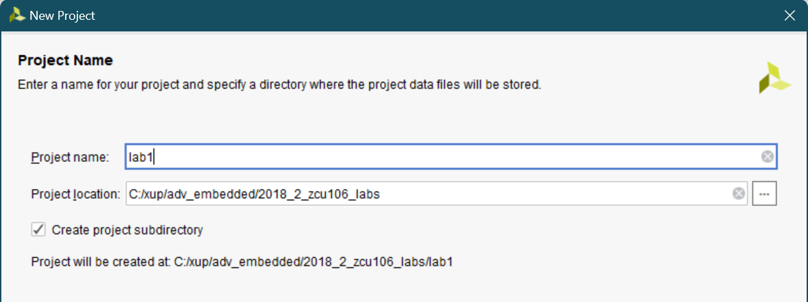
    

    

    <i>Project Name Entry</i>
    

5. Select the **RTL Project** option in the _Project Type_ form, and click **Next**.
6. Select **Verilog** as the _Target Language_ and _Simulation Language_ in the _Add Sources_ form, and click **Next**.
7. Click **Next** to skip adding constraints.
8. In the _Default Part_ form, click **Boards** filter.
9. In the *Boards* tab and then select **Zynq UltraScale+ ZCU106 Evaluation Platform**, and click **Next**.
    

    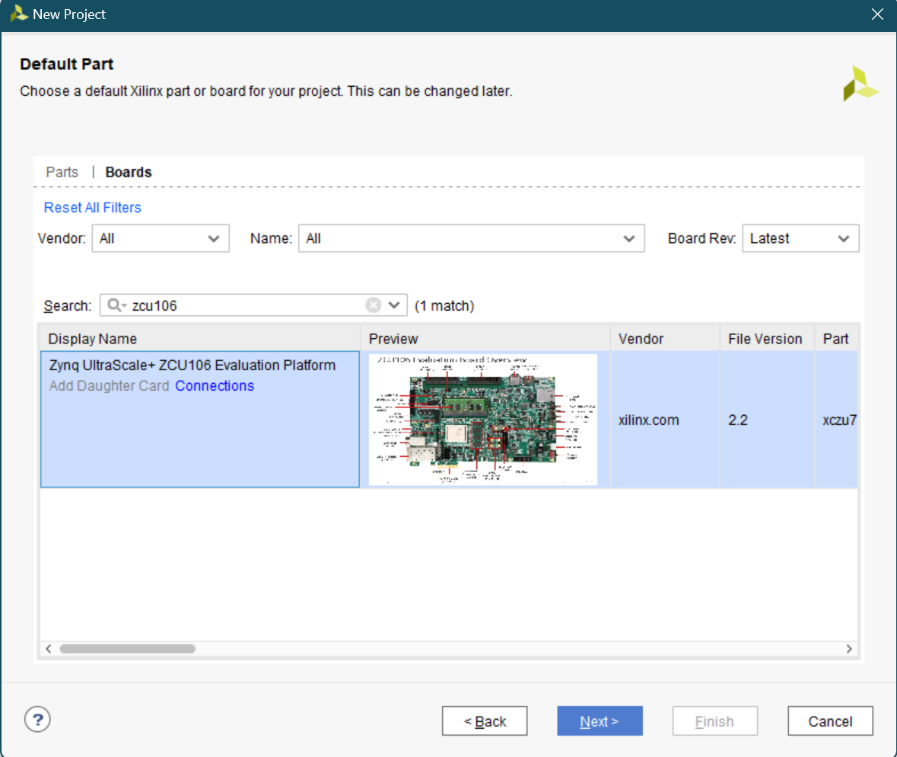
    

    

    <i>Board Selection (ZCU106)</i>
    

10. Click **Finish** to create an empty Vivado project.

### Creating the Hardware System Using IP Integrator

1. Create a block design in the Vivado project using IP Integrator to generate the quad core Arm® Cortex™-A53 processing system (PS) and a dual core Arm Cortex-R5F real-time processor based hardware system.
2. In the Flow Navigator, click **Create Block Design** under IP Integrator.
3. Name the block **system** and click **OK**.
4. Click on the  button.
5. Once the IP Catalog is open, type zynq into the Search bar, and double click on the **Zynq UltraScale+ MPSoC** entry to add it to the design.
6. Click on **Run Block Automation** and click **OK** to automatically configure the board presets.
7. Double click on the Zynq block to open the _Customization_ window for the Zynq UltraScale+ MPSoC.

    A block diagram of the PS UltraScale+ should now be open, showing various configurable blocks of the Processing System.

8. At this stage, designer can click on various configurable blocks (highlighted in green) and change the system configuration.
    

    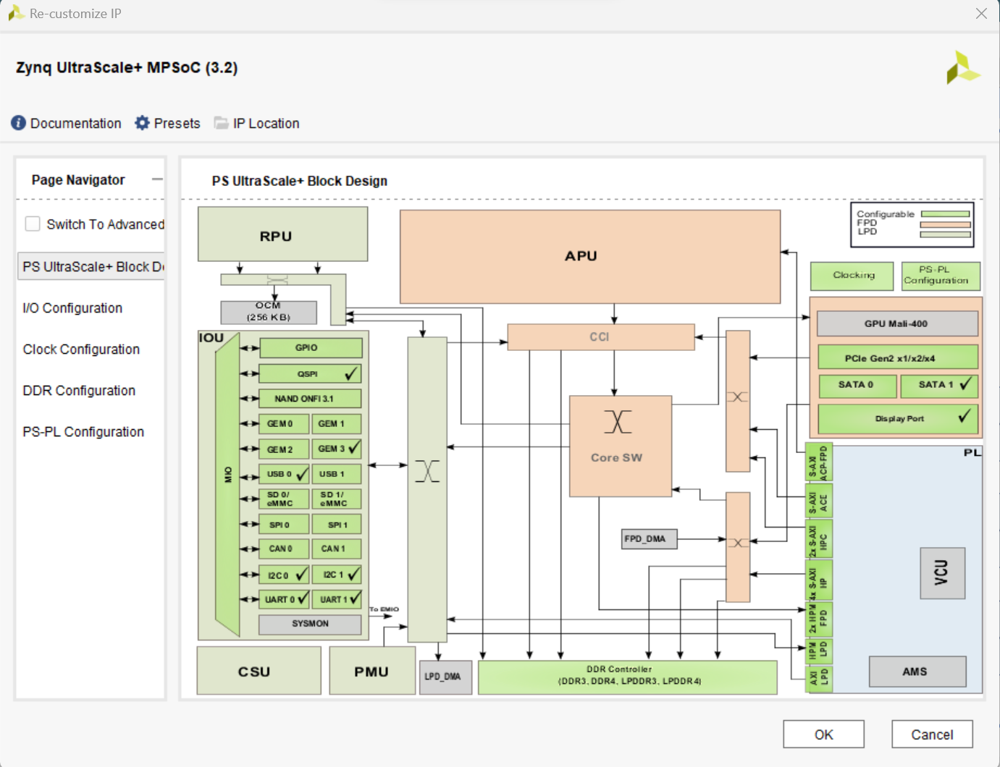
    

    

    <i>Zynq UltraScale+ MPSoC Configuration View</i>
    

#### Configure the I/O Peripherals block to have UART support.
1. Click on the _I/O Configuration_ panel to open its configuration form.
2. Expand the I/O Peripherals (and GPIO).
3. Deselect CAN and GPIO the peripherals except _UART_.
    

    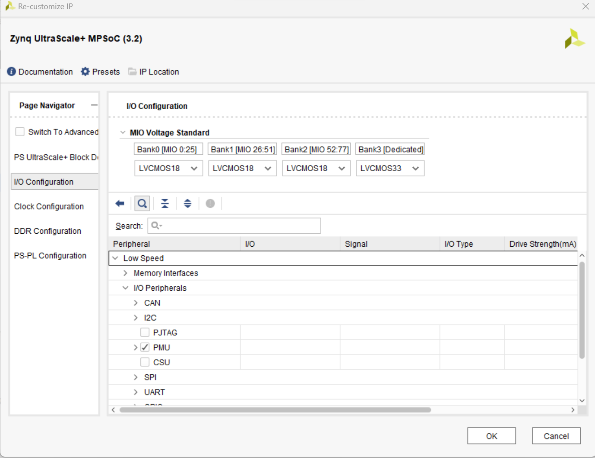
    

    

    <i>Selecting UART Peripheral of PS</i>
    

4. Select _PS-PL Configuration_ > _PS-PL interfaces_ > _Master interface_, disable AXI HPM0 FPD and AXI HPM1 FPD, then enable the AXI HPM0 LPD option.
5. Click **OK**.

    The configuration form will close and the block diagram will be updated as shown below.
    

    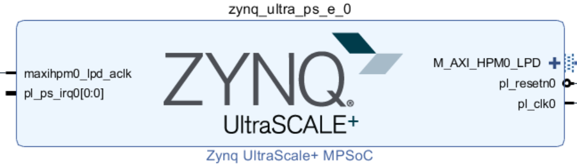
    

    

    <i>Zynq UltraScale+ MPSoC configured block</i>
    

### Add one instance of GPIO, name it _buttons_, and configure for the board. Connect the block to the Zynq.

1. Click the  button and search for **AXI GPIO** in the catalog.
2. Double-click the **AXI GPIO** to add an instance of the core to the design.
3. Click on the **AXI GPIO** block to select it, and in the _Block properties_ tab, change the name to **buttons.**
4. Double click on the **AXI GPIO** block to open the customization window. Under _Board Interface_, for _GPIO_, click on **Custom** to view the drop down menu options, and select **push buttons 5bits** for the ZCU106 board.

    As the board was selected during the project creation, and a board support package is available for these boards, Vivado has knowledge of available resources on the board.

5. Click the **IP Configuration** tab. Notice the GPIO Width is set to 5 and is greyed out.  If a board support package was not available, the width of the IP could be configured here.
6. Click **OK** to finish configuring the GPIO and to close the _Re-Customize IP_ window.
7. Click on **Run Connection Automation** , and select **buttons** (which will include GPIO and S\_AXI)

    Click on **GPIO** and **S\_AXI** to check the default connections for these interfaces.
    

    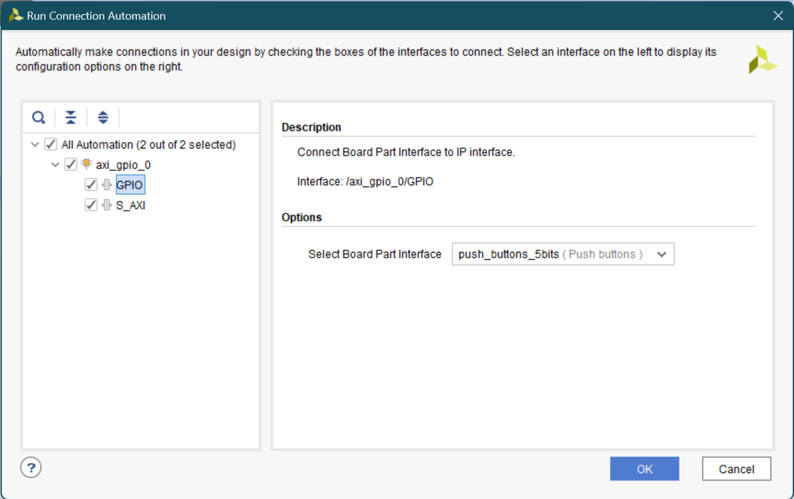
    

    

    <i>Connection Automation for the GPIO</i>
    

8. Click **OK** to automatically connect the _S\_AXI_ interface to the Zynq _GP0_ port (through the AXI interconnect block), and the GPIO port to an external interface.

    Notice that after block automation has been run, two additional blocks that are required to connect the blocks, _Processor System Reset_, and _AXI Interconnect_ have automatically been added to the design.

9. Add another instance of GPIO, name the instance _leds_, configure it and connect it to the Zynq.
10. Add another instance of the _GPIO_ peripheral **.**
11. Change the name of the block to **leds.**
12. Double click on the _leds_ block, and select **leds 8bits** for the _GPIO_ interface and click **OK.**
13. Click on **Run Connection Automation**
14. Click **leds** , and check the connections for _GPIO_ and _S\_AXI_ as before
15. Click **OK** to automatically connect the interfaces as before.

    Notice that the AXI Interconnect block has the second master AXI (M01\_AXI) port added and connected to the S\_AXI of the leds.

16. Add another instance of GPIO, name the instance _switches_, configure it and connect it to the Zynq.
17. Add another instance of the _GPIO_ peripheral **.**
18. Change the name of the block to **switches.**
19. Double click on the _switches_ block, and select **dip switches 8bits** for the _GPIO_ interface and click **OK.**
20. Click on **Run Connection Automation**
21. Click **switches** , and check the connections for _GPIO_ and _S\_AXI_ as before
22. Click **OK** to automatically connect the interfaces as before.

    Notice that the AXI Interconnect block has the third master AXI (M02\_AXI) port added and connected to the S\_AXI of the leds.

    At this stage the design should look like as shown below.
    

    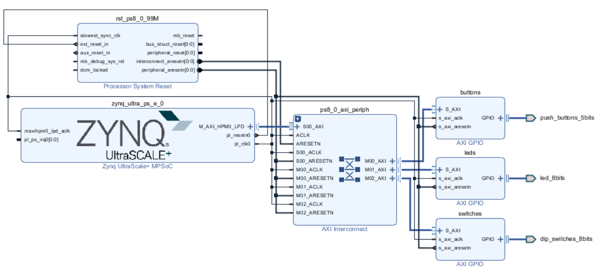
    

    

    <i>Completed design</i>
    

23. Verify that the addresses are assigned to the two GPIO instances and validate the design for no errors.
24. Select the **Address Editor** tab and see that the addresses are assigned to the three GPIO instances.  They should look like as follows.
    

    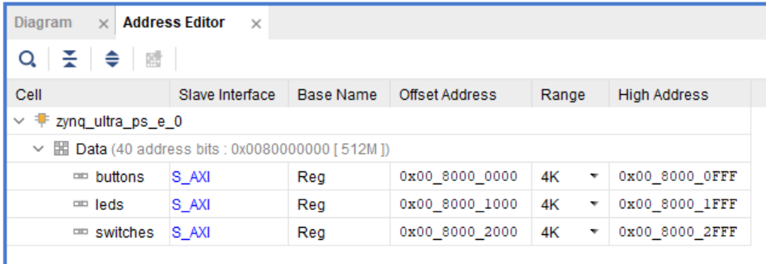
    

    

    <i>Assigned addresses</i>
    

25. Select the _Diagram_ tab, and click on the 
 (Validate Design) button to make sure that there are no errors.
 
    Ignore warnings.

26. Select **File &gt; Save Block Design** to save the design.
27. Since all IO pins are board-aware no additional user constraints are need.

### Generate the Bitstream        
1. Create the top-level HDL of the embedded system.  Add the provided constraints file and generate the bitstream.
2. In Vivado, select the _Sources_ tab, expand the _Design Sources,_ right-click the _system.bd_ and select **Create HDL Wrapper…**
    

    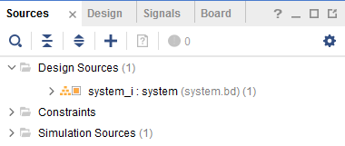
    

    

    <i>Selecting the system design to create the wrapper file</i>
    

3. Click **OK** when prompted to allow Vivado to automatically manage this file.

    The wrapper file, _system\_wrapper.v_, is generated and added to the hierarchy.  The wrapper file will be displayed in the Auxiliary pane.
    

    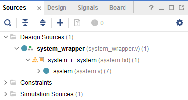
    

    

    <i>Design Hierarchy View</i>
    

4. Click on the **Generate Bitstream** in the _Flow Navigator_ pane to synthesize and implement the design, and generate the bitstream. Click **Save** and **Yes** if prompted. Click **OK** to launch the runs.
5. When the bitstream generation is complete, click **Cancel**.

### Export the Design to the SDK
#### Exporting the design and launch SDK
1. Export the hardware configuration by clicking **File &gt; Export &gt; Export Hardware** … Tick the box to include the bitstream and click **OK**.
    

    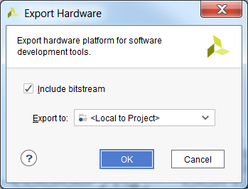
    

    

    <i>Exporting the hardware</i>
    

2. Launch SDK by clicking **File &gt; Launch SDK** and click **OK**

    (Launching SDK from Vivado will automatically load the SDK workspace associated with the current project. If launching SDK standalone, the workspace will need to be selected.)

## Generate an Application in SDK
### Generate a board support package project with default settings and default software project name.

SDK should open and automatically create a hardware platform project based on the configuration exported from Vivado. A board support package and software application will be created and associated with this hardware platform.

1. Select **File** &gt; **New** &gt; **Board Support Package**
    

    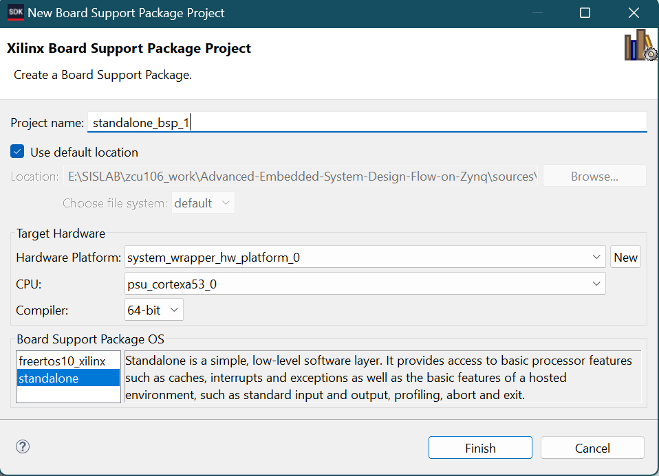
    

    

    <i>Create BSP</i>
    

2. Click **Finish** with the default settings selected (using the Standalone operating system).

    This will open the Software Platform Settings form showing the OS and libraries selections.

3. Click **OK** to accept the default settings as we want to create a **standalone\_bsp\_0** software platform project without any additional libraries.
4. The library generator will run in the background and will create the **xparameters.h** file in the **lab1.sdk\standalone\_bsp\_0\psu\_cortexa53\_0\include** directory.
5. Create an empty application project, named lab1, and import the provided lab1.c file.
6. Select **File &gt; New** &gt; **Application Project.**
7. In the _Project Name_ field, enter **lab1** as the project name.
8. Select the _Use existing_ option in the _Board Support Package_ field and then click **Next.**
    

    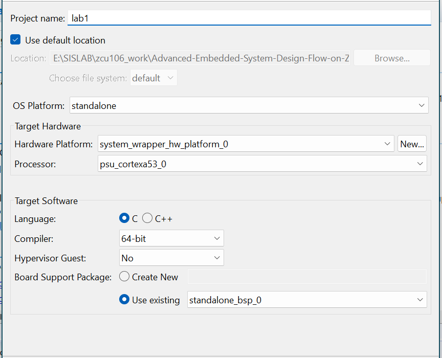
    

    

    <i>Create a Blank Application Project</i>
    

9. Select the **Empty Application** template and click **Finish.**

    The lab1 project will be created in the Project Explorer window of SDK.

10. Select **lab1 &gt; src** directoryin the project view, right-click, and select **Import.**
11. Expand the **General** category and double-click on **File System.**
12. Browse to the **{sources}\lab1** folder.
13. Select the **lab1.c** source file and click **Finish.**

    A snippet of the source code is shown in the following figure. Note the greyed out code will be used in Lab5. The code reads from the switches, and writes to the LEDs. The BTN is read, and written to the LED.
    

    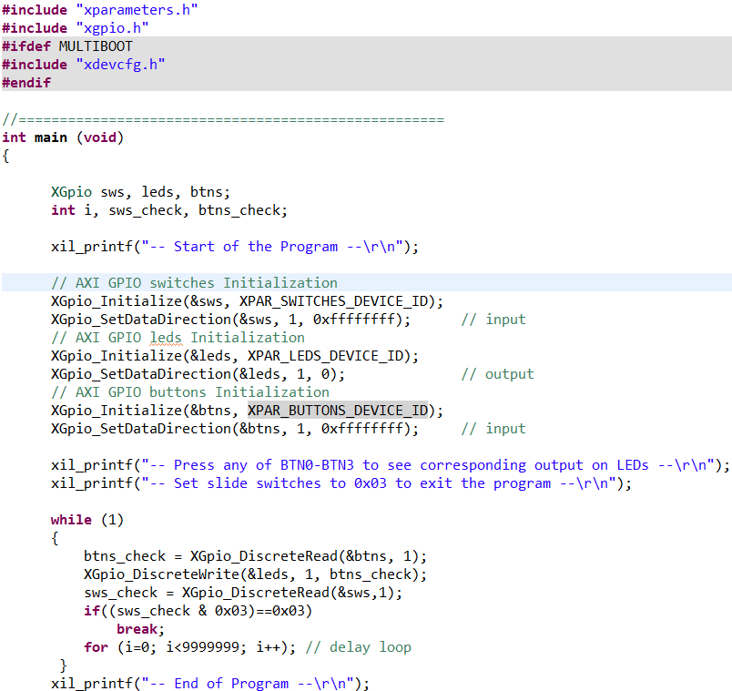
    

    

    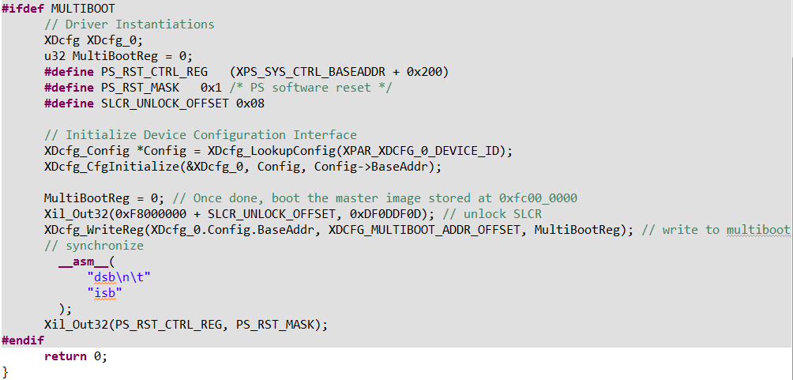
    

    

    <i>Snippet of Source Code</i>
    

## Test in Hardware
### Connect and power up the board. Establish serial communications using the SDK&#39;s Terminal tab.  Verify the design functionality.
1. Connect and power up the board.
2. Select the 
 tab.  If it is not visible then select **Window &gt; Show view &gt; Other &gt; Terminal &gt; Terminal**.
3. Click on  and select appropriate COM port (depending on your computer), and configure the terminal with the parameters as shown below.
    

    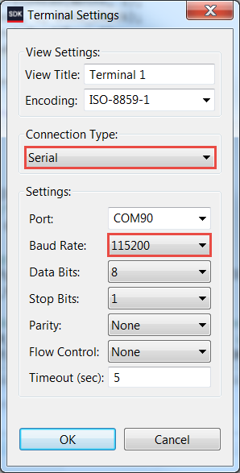
    

    

    <i>SDK Terminal Settings</i>
    

4. Select **Xilinx** &gt; **Program FPGA** and then click the **Program** button.
5. Select the **lab1** project in the _Project Explorer_, right-click and select **Run As &gt; Launch on Hardware(System Debugger)** to download the application, execute psu\_init, and execute lab1.elf.
6. You should see the following output on the Terminal console.
7. Press BTN0-BTN4 and see the corresponding LED light up.
8. Close SDK and Vivado programs by selecting **File &gt; Exit** in each program.
9. Turn OFF the power to the board.

## Conclusion

In this lab, you created the quad core Arm® Cortex™-A53 processing system (PS) based embedded system using the Zynq device for the ZCU106 board.  You instantiated the Xilinx standard GPIO IP to provide input and output functionality.

You created the project in Vivado, created the hardware system using IPI, implemented the design in Vivado, exported the generated bitstream to the SDK, created a software application in the SDK, and verified the functionality in hardware after programming the PL section and running the application from the DDR memory.