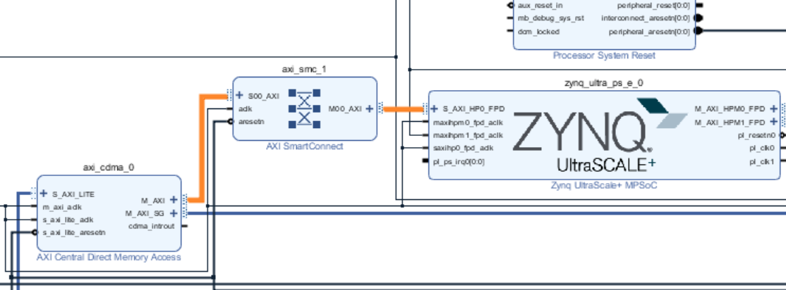
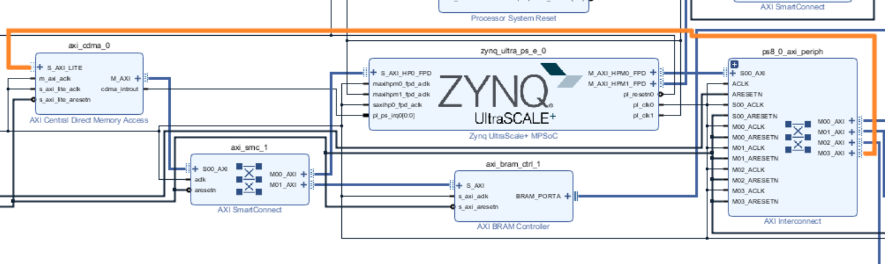
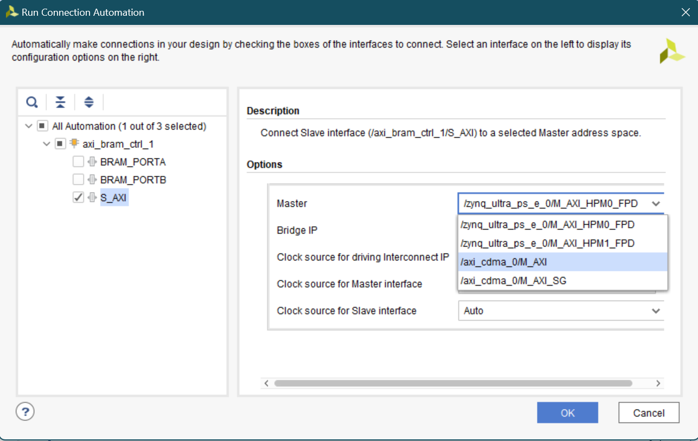
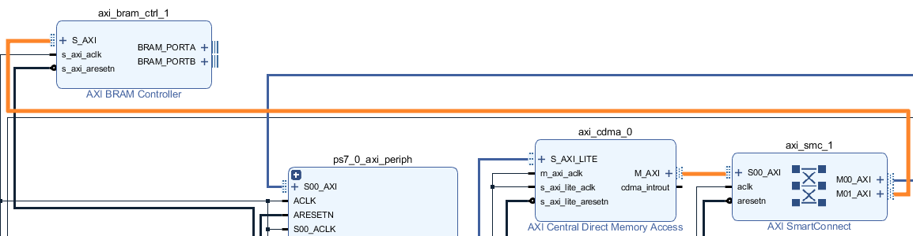
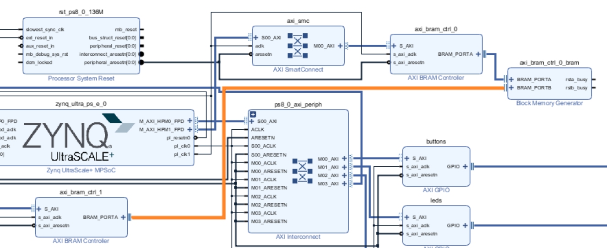
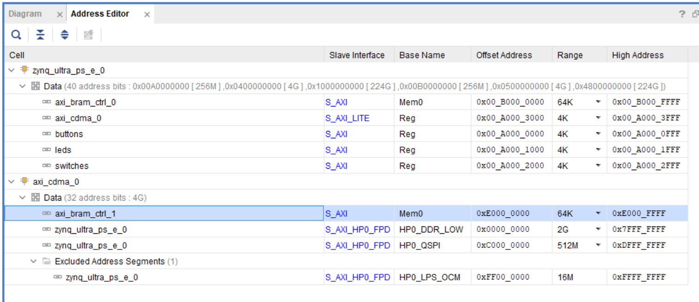
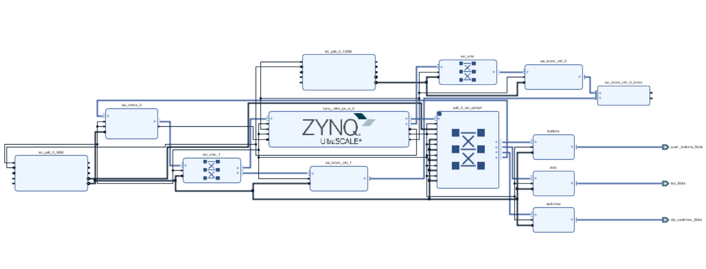

# Direct Memory Access using CDMA

## Objectives

After completing this lab, you will be able to:

* Enable a High Performance (HP) port of the processing system
* Add and connect the CDMA controller in the programmable logic
* Perform DMA operation between various memories

## Steps
## Open the Project        
### Open the Vivado program. Open the _lab3_ project you created earlier or use the _lab3_ project from the labsolutions directory, and save the project as _lab4_.
1. Start Vivado if necessary and open either the lab3 project (lab3.xpr) you created earlier or the lab3 project in the labsolution directory using the **Open Project** link in the Getting Started page.
2. Select **File &gt; Project &gt; Save As …** to open the _Save Project As_ dialog box. Enter **lab4** as the project name.  Make sure that the _Create Project Subdirectory_ option is checked, the project directory path is **{labs}** and click **OK**.
3. This will create the lab4 directory and save the project and associated directory with lab4 name.
## Configure the Processor to Enable S\_AXI\_HP0\_FPD 
### Open the Block Design and enable the S\_AXI\_HP0\_FPD interface
1. Click **Open Block Design** in the _Flow Navigator_ pane
2. Double-click on the _Zynq UltraScale+ MPSoC_ instance to open its configuration form.
3. Select _PS-PL Configuration_ in the Page Navigator window in the left pane, select _PS-PL Configuration_ > _PS-PL interfaces_ > _Slave interface_ > _AXI HP_ on the right, and click on the check-box of the **AXI HP0 FPD** to enable it, and click **OK** to close the Configuration window.
## Add CDMA and BRAM        
### Instantiate the AXI central DMA controller.
1. Click the  button and search for **Central** in the catalog.
2. Double-click the **AXI Central Direct Memory Access** to add an instance to the design.
3. Double-click on the _axi\_cdma\_0_ instance and uncheck the _Enable Scatter Gather_ option.
4. Change the _Write/Read Data Width_ to **64** and click **OK**.

    Note the burst size changes from 16 to 8. You can increase this up to 256 to improve the performance. Here we are using smallest number since the application allows small number of words transfer.

### Run connection automation

Connection automation could be run on all unconnected ports simultaneously. For the purposes of this lab, each port will be connected separately so that the changes made by the automation process are easier to follow.

1. Click on **Run Connection Automation** and select **zynq\_ultra\_ps\_e\_0/S\_AXI\_HP0\_FPD**
2. Check that this port will be connected to the _/axi\_cdma\_0/M\_AXI_ port and click **OK**.

    

    
    

    

    <i>Connection automation</i>
    

3. Verify the CDMA connection through the AXI SmartConnect to the HP0 port
    

    
    

    

    <i>Connecting AXI Central DMA controller to S_AXI_HP0_FPD</i>
    

    Notice that an instance of AXI SmartConnect (axi_smc_1) is added, S_AXI_HP0_FPD of the zynq_ultra_ps_e_0 is connected to M00_AXI of the axi_smc_1, S00_AXI of the axi_smc_1 is connected to the m\_axi of the axi_cdma_0 instance.  Also, m_axi_aclk of the axi_cdma_0 is connected to the net originating from pl_clk0 of the zynq_ultra_ps_e_0.

4. Click on **Run Connection Automation** again, and select **/axi\_cdma\_0** (which includes **S\_AXI\_LITE** ).

    Notice that the axi\_cdma\_0/M\_AXI port is no longer available to select. This is because it was connected to the processing system in the previous step.

5. Ensure /zynq\_ultra\_ps\_e\_0/M\_AXI\_HPM0\_FPD is selected in the drop-down button and click **OK**.
    

    
    

    

    <i>CDMA connected</i>
    

### Instantiate another BRAM Controller and a BRAM.
1. Click the  button and search for **BRAM** in the catalog.
2. Double-click the **AXI BRAM Controller** to add an instance to the design.
3. Click on **Run Connection Automation** , and select **/axi\_bram\_ctrl\_1/S\_AXI** only.
4. For the _Master_ connection, _s_elect **axi\_cdma\_0/M\_AXI** from the dropdown box.
    

    
    

    

    <i>BRAM connection automation</i>
    

5. Click **OK** tomake the connection.

    Notice that another axi interface (M01\_AXI) is added to the axi\_smc\_1 instance and is connected to the S\_AXI interface of the axi\_bram\_ctrl\_1 instance.
    

    
    

    

    <i>Connection between the new BRAM controller and the CDMA</i>
    

6. Double-click the _axi\_bram\_ctrl\_1_ instance and change the _Number of BRAM Interface_ to **1**.
7. Change the _Data Width_ to **64** and click **OK**.
8. Double-click the _axi\_bram\_ctrl\_0_ instance and also change the _Number of BRAM Interface_ to **1**. Click **OK**.
9. Using the wire tool, connect the **BRAM\_PORTA** of the _axi\_bram\_ctrl\_1_ instance to the **BRAM\_PORTB** of the Block Memory Generator _axi\_bram\_ctrl\_0\_bram_ instance.

    

    
    

    

    <i>Connect the second BRAM controller</i>
    

10. Connect the **cdma\_introut** to the **pl\_ps\_irq0** port.
### Using the Address Editor tab, set the BRAM controller size to 64KB.  Validate the design.
1. Select the **Address Editor** tab.
2. Expand the _axi\_cdma\_0&gt; Data_ section, and change the memory size of _axi\_bram\_ctrl\_1_ to **64K**.
    

    
    

    

    <i>Address space</i>
    

1. The design should look similar to the figure below.
    

    
    

    

    <i>Completed design</i>
    

1. Select the _Diagram_ tab, and click on the   (Validate Design) button to make sure that there are no errors.
## Generate the Bitstream        
1. Click on the **Generate Bitstream** to run the synthesis, implementation, and bit generation processes.
1. Click **Save** to save the project, and **Yes** if prompted to run the processes. Click **OK** to launch the runs.
1. When the bitstream generation process has completed successfully, click **Cancel**.
## Generate an Application in the SDK
### Export the implemented design, and start SDK
1. Export the hardware configuration by clicking **File &gt; Export &gt; Export Hardware…**
1. Click the box to _Include Bitstream_and click **OK** (Click _Yes_ if prompted to overwrite a previous module)
1. Launch SDK by clicking **File &gt; Launch SDK** and click **OK**
1. To clean the workspace, right-click on each open project except_system\_wrapper\_hw\_platform\_2_ and select close project.
### Create an empty application project, named lab4, and import the provided lab4.c file.
1. Select **File &gt; New** &gt; **Application Project.**
1. In the _Project Name_ field, enter **lab4** as the project name.
1. Leave the default settings to create a new _Board Support Package_ and click **Next.**
1. Select the **Empty Application** template and click **Finish.**

    The lab4 project will be created in the Project Explorer window of SDK.

1. Select **lab4 &gt; src** in the project view, right-click, and select **Import.**
1. Expand the **General** category and double-click on **File System.**
1. Browse to the **{sources}\lab4** folder.
1. Select **lab4.c** and click **Finish.**
## Test in Hardware        
### Connect and power up the board. Download the bitstream and program the FPGA.
1. Connect and power up the board.
1. In SDK, select **Xilinx &gt; Program FPGA.**
1. Click the **Program** button to program the FPGA.
### Establish serial communication, and run the lab4 application from the DDR3 memory.
1. Connect the terminal by selecting the appropriate COM port and setting the Baud Rate to **115200**.
1. Run the **lab4** application **.**

    Follow the menu in the terminal emulator window and test transfers between various memories.

1. Select option 4 in the menu to complete the execution.
1. Close the SDK and Vivado programs by selecting **File &gt; Exit** in each program.
1. Turn OFF the power on the board.

## Conclusion

This lab led you through adding a CDMA controller to the PS so that you can perform DMA transfers between various memories. You used the high-performance port so DMA could be done between the BRAM residing in the PL section and DDR3 connected to the PS. You verified the design functionality by creating an application and executing it from the DDR3 memory.
