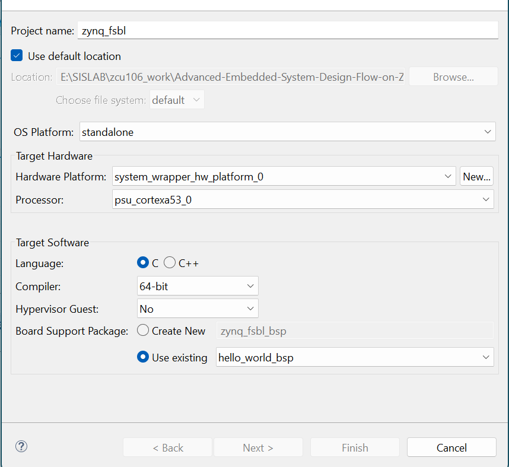
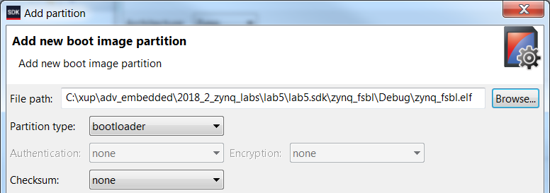
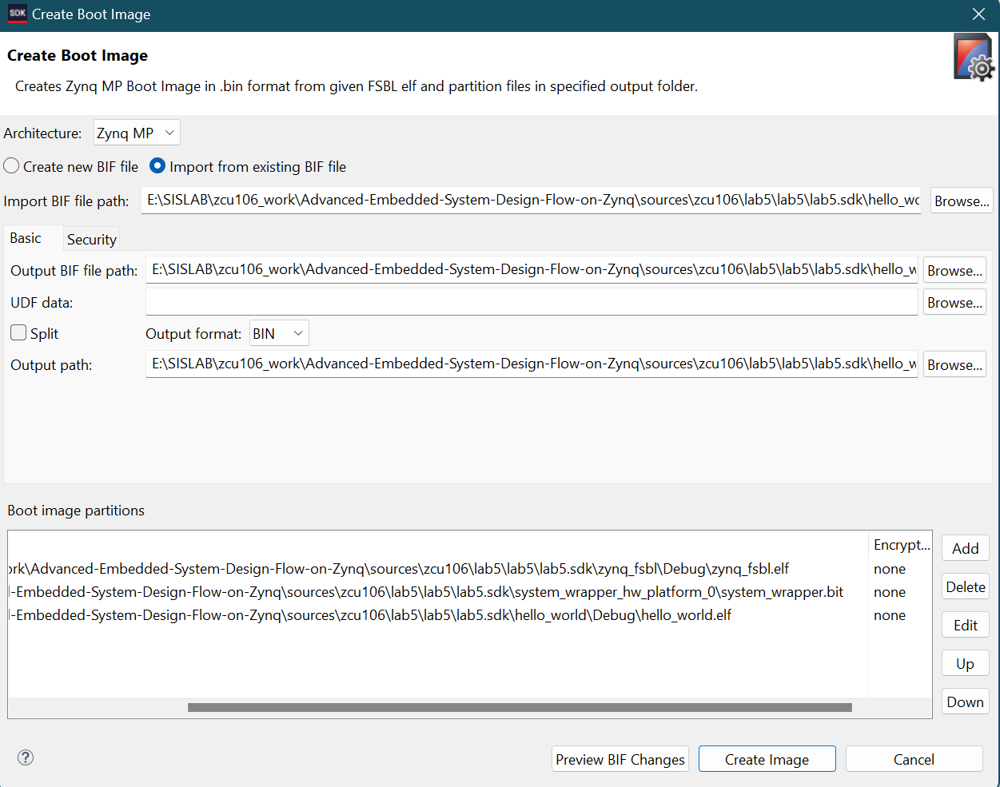
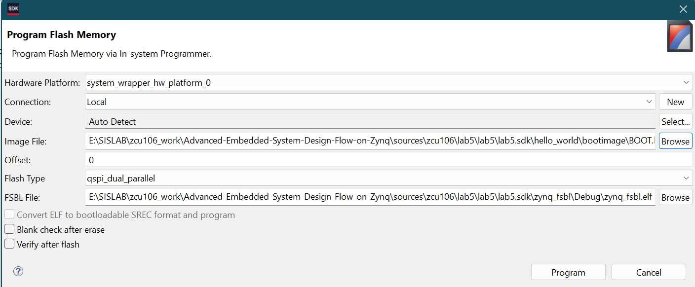
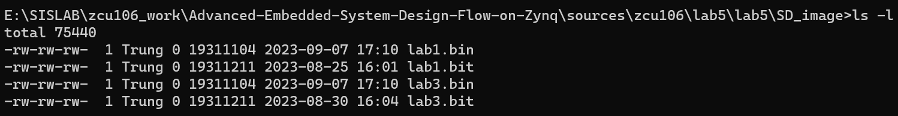
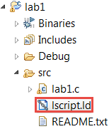

# Configuration and Booting

## Objectives

After completing this lab, you will be able to:

* Create a bootable system capable of booting from the SD card
* Create a bootable system capable of booting from the QSPI flash
* Load the bitstream stored on the SD card or in the QSPI flash memory
* Configure the PL section using the stored bitstream through the PCAP resource
* Execute the corresponding application

## Steps
## Create a Vivado Project
### Launch Vivado and create an empty project, called lab5, using the Verilog language.
1. Open Vivado and click **Create New Project** and click **Next**.
2. Click the Browse button of the _Project Location_ field of the **New Project** form, browse to { **labs}** , and click **Select**.
3. Enter **lab5** in the _Project Name_ field.  Make sure that the _Create Project Subdirectory_ box is checked.  Click **Next**.
4. Select the **RTL Project** option in the _Project Type_ form, and click **Next**.
5. Select **Verilog** as the _Target Language_ in the _Add Sources_ form, and click **Next**.
6. Click **Next** two times.
7. In the *Boards* tab and then select **Zynq UltraScale+ ZCU106 Evaluation Platform**, and click **Next**.
8. Click **Finish** to create an empty Vivado project.
## Creating the Hardware System Using IP Integrator
### Create a block design in the Vivado project using IP Integrator to generate the quad core Arm® Cortex™-A53 processing system (PS) based hardware system.
1. In the Flow Navigator, click **Create Block Design** under IP Integrator.
2. Name the block **system** and click **OK**.
3. Click the  button.
4. Once the IP Catalog is open, type zynq into the Search bar, and double click on **Zynq UltraScale+ MPSoC** entry to add it to the design.
5. Click on _Run Block Automation_ in the message at the top of the _Diagram_ panel. Leave the default option of _Apply Board Preset_ checked, and click **OK**.
6. Double click on the Zynq block to open the _Customization_ window.

    A block diagram of the Zynq should now be open, showing various configurable blocks of the Processing System.

### Configure the Zynq UltraScale+ MPSoC block.
1. Click on the _Clock Configuration_ panel, then open _Output Clocks_ > _PL Fabric Clocks_, then disable **PL0**.
2. Click on the _PS-PL Configuration_ panel, disable **Fabric Reset Enable**, then open _General_ > _Interrupts_ > _PL to PS_, select **IRQ[0-7]** to _0_, 
3. Select _PS-PL Interfaces_ > _Master Interface_, then disable _AXI HPM0 FPD_ and _AXI HPM1 FPD_.
4. Click **OK**.

    The configuration form will close and the block diagram will be updated.

5. Select the _Diagram_ tab, and click on the  (Validate Design) button to make sure that there are no errors.
## Export the Design to the SDK and create the software projects        
### Create the top-level HDL of the embedded system, and generate the bitstream.
1. In Vivado, select the _Sources tab_, expand the _Design Sources,_ right-click the _system.bd_ and select **Create HDL Wrapper** and click **OK.**
2. Click on **Generate Bitstream** and click **Generate**. Click **Save** to save the project, and **Yes** if prompted to run the processes. Click **OK** to launch the runs.
3. When the bitstream generation process has completed successfully, click **Cancel**.
### Export the design to the SDK and create the Hello World application.
1. Export the hardware configuration by clicking **File &gt; Export &gt; Export Hardware…**
2. Click the box to _Include Bitstream_, then click **OK**
3. Launch SDK by clicking **File &gt; Launch SDK** and click **OK**
4. In SDK, select **File** &gt; **New** &gt; **Application Project.**
5. Enter **hello\_world** in the project name field, and leave all other settings as default.
6. Click **Next** and make sure that the _Hello World_ application template is selected, and click **Finish** to generate the application.
7. Right click on hello\_world\_bsp and click **Board Support Package Settings**
8. Tick to include _xilffs_, _xilpm_ and _xilsecure_ click **OK** (This is required for the next step to create the FSBL).
### Create a first stage bootloader (FSBL).
1. Select **File** &gt; **New &gt; Application Project.**
2. Enter **zynq\_fsbl** as the project name, select the _Use existing_ standalone Board Support Package option with **hello\_world\_bsp** , and click **Next**.
    

    
    

    

    <i>Creating the FSBL Application</i>
    

3. Select _Zynq FSBL_ in the **Available Templates** pane and click **Finish**.

    A zynq\_fsbl project will be created which will be used in creating the BOOT.bin file.  The BOOT.bin file will be stored on the SD card which will be used to boot the board.

## Create the Boot Images and Test
### Using the Windows Explorer, create a directory called _image_ under the lab5 directory. You will create the BOOT.bin file using the FSBL, system\_wrapper.bit and hello\_world.elf files.
1. Using the Windows Explorer, create a directory under the _lab5_ directory and call it **image**.
2. In the SDK, select **Xilinx &gt; Create Boot Image**.

    Click on the Browse button of the **Output BIF** field, browse to **{labs}\lab5\image** and click **Save** (leaving the default name of output.bif)

3. Click on the **Add** button of the _Boot image partitions,_ click the Browse button in the Add Partition form, browse to **{labs}\lab5\lab5.sdk\zynq\_fsbl\Debug** directory (this is where the FSBL was created), select _zynq\_fsbl.elf_ and click **Open**.

    Note the partition type is bootloader, then click **OK.**

    

    
    

    

    <i>Adding FSBL partition</i>
    

4. Click on the **Add** button of the _Boot image partitions_ and add the bitstream, **system\_wrapper.bit** , from **{labs}\lab5\lab5.sdk\system\_wrapper\_hw\_platform\_0** and click **OK**.
5. Click on the **Add** button of the _Boot image partitions_ and add the software application, **hello\_world.elf** , from **{labs}\lab5\lab5.sdk\hello\_world\Debug** and click **OK**.
6. Click the **Create Image** button.

    The BOOT.bin and the output.bif files will be created in the **{labs}\lab5\image** directory.  We will use the BOOT.bin for the SD card boot up.

    

    
    

    

    <i>Creating BOOT.bin image file</i>
    

7. Insert a blank SD/MicroSD card (FAT32 formatted) in a Card reader, and using the Windows Explorer, copy the BOOT.bin file from the **image** folder in to the SD/MicroSD card.
### Set the board in SD card boot mode. Test the functionality by starting a Terminal emulator program and powering ON the board.
1. Set the board in the SD card boot mode.
2. Insert the SD/MicroSD card into the board.
3. Power ON the board.
4. Connect your PC to the UART port with the provided micro-USB cable, and start Terminal or SDK Terminal in SDK or a Terminal emulator program setting it to the current COM port and 115200 baudrate.
5. You should see the **Hello World** message in the terminal emulator window.  If you don&#39;t see it, then press the PS\_RST/PS\_SRST button on the board.
6. Once satisfied power OFF the board and remove the SD card.
### Set the board in the QSPI boot mode.  Power ON the board, Program the QSPI using the Flash Writer utility, and test by pressing PS-RST button.
1. Set the board in the QSPI mode.
2. Power ON the board.
3. Connect your PC to the UART port with the provided micro-USB cable, and start a Terminal emulator program setting it to the current COM port and an 115200 baud rate.
4. Select **Xilinx &gt; Program Flash**.
5. In the _Program Flash Memory_ form, click the **Browse** button of the Image File field, browse to the **{labs}\lab5\image** directory, select **BOOT.bin** file, and click **Open**.
6. Click on the FSBL File Browse button, browse to **{labs}\lab5\lab5.sdk\zynq\_fsbl\Debug** directory (this is where the FSBL was created), select _zynq\_fsbl.elf_ and click **Open**.
7. In the _Offset_ field enter **0** as the offset and click the **Program** button.

    The QSPI flash will be programmed.

    

    
    

    

    <i>Program Flash Memory form</i>
    

8. Disconnect and reconnect the Terminal window.
9. Press the PS-RST to see the **Hello World** message in the terminal emulator window.
10. Once satisfied, power OFF the board.
## Prepare for the Multi-Applications Boot Using SD Card        
### The lab1 and lab3 executable files are required in the .bin format before copying to the SD card. The area in memory allocated for each application need to be modified so that they do not overlap each other, or with the main application. The prepared bin files provided in the directory: {sources}\lab5\SDCard can be used for copying to the SD card. Follow steps in Appendix A-1 and A-2 if you want to generate by yourself.

### Create the lab5\_sd application using the provided lab5\_sd.c and devcfg.c, devcgf.h, load\_elf.s files.
1. Select **File** &gt; **New** &gt; **Application Project.**
2. Enter **lab5\_sd** as the project name, click the _Use existing_ option in the _Board Support Package_ (BSP) field and select _hello\_world\_bsp_, and then click **Next.**
3. Select _Empty Application_ in the **Available Templates** pane and click **Finish**.
4. Select **lab5\_sd &gt; src** in the project view, right-click, and select **Import.**
5. Expand the General folder and double-click on **File system,** and browse to the **{sources}\lab5** directory.
6. Select **devcfg.c, devcfg.h, load\_elf.s** , and **lab5\_sd.c,** and click **Finish.**
7. Change, if necessary, LAB1\_ELFBINFILE\_LEN, LAB3\_ELFBINFILE\_LEN, LAB1\_ELF\_EXEC\_ADDR, LAB3\_ELF\_EXEC\_ADDR values and save the file.
## Create the SD Card Image and Test
### Using the Windows Explorer, create the SD\_image directory under the lab5 directory. You will first need to create the bin files from lab1 and lab3.
1. Using the Windows Explorer, create directory called **SD\_image** under the **lab5** directory.
2. In Windows Explorer, copy the **system\_wrapper.bit** of the lab1 project into the _SD\_image_ directory and rename it _lab1.bit_, and do similar for lab3

    {labs}/lab1/lab1.runs/impl\_1/system\_wrapper.bit -&gt; SD\_image /lab1.bit

    {labs}/lab3/lab3.runs/impl\_1/system\_wrapper.bit -&gt; SD\_image /lab3.bit

    The XSDK _bootgen_ command will be used to convert the bit files into the required binary format. bootgen requires a .bif file which has been provided in the sources/lab5 directory. The .bif file specifies the target .bit files.

3. Open a command prompt by selecting **Xilinx &gt; Launch Shell.**
4. In the command prompt window, change the directory to the bitstreams directory.

    cd {labs}/lab5/SD\_image

5. Generate the partial bitstream files in the BIN format using the provided &quot;.bif&quot; file located in the _sources_ directory. Use the following command:

    bootgen -image ..\ ..\ ..\2018\_2\_zynq\_sources\lab5\bit\_files.bif -w -process\_bitstream bin -packagename xczu7ev

6. Rename the files _lab1.bit.bin_ and _lab3.bit.bin_ to _lab1.bin_ and _lab3.bin_
7. The size of the file needs to match the size specified in the **lab5\_sd.c** file. The size can be determined by checking the file&#39;s properties. If the sizes do not match, then make the necessary change to the source code and save it (The values are defined as LAB1\_BITFILE\_LEN and LAB3\_BITFILE\_LEN).

    

    
    

    

    <i>Checking the size of the generate bin file</i>
    

    Note that the lab1.bin and lab3.bin files should be the same size.

### You will create the BOOT.bin file using the first stage bootloader, system\_wrapper.bit and lab5\_sd.elf files.
1. In the SDK, select **Xilinx &gt; Create Boot Image**.
2. For the Output BIF file path, click on the Browse button and browse to **{labs}\lab5\SD\_image** directory and click **Save**.
3. Click on the **Add** button and browse to **{labs}\lab5\lab5.sdk\zynq\_fsbl\debug** , select **zynq\_fsbl.elf** , click **Open** , and click **OK**.
4. Click on the **Add** button of the _boot image partitions_ field and add the bitstream file, **system\_wrapper.bit** , from **{labs}\lab5\lab5.sdk\system\_wrapper\_hw\_platform\_0** and click **OK**
5. Click on the **Add** button of the _boot image partitions_ field and add the software application, **lab5\_sd.elf** , from the **{labs}\lab5\lab5.sdk\lab5\_sd\Debug** directory and click **OK**
6. Click the **Create Image** button.

    The BOOT.bin file will be created in the **lab5\SD\_image** directory.

### Either copy the labxelf.bin files (two) from the sources directory or from the individual directories (if you did the optional part in the previous step and place them in the SD\_image directory. Copy all the bin files to the SD card. Configure the board to boot from SD card. Power ON the board. Test the design functionality
1. In Windows explorer, copy the **lab1elf.bin** and **lab3elf.bin** files either from the **{sources}\lab5\SDCard** directory or from the individual directories (if you did the optional parts in the previous step) and place them in the **SD\_image** directory.

    {labs}\lab1\lab1.sdk\lab1\Debug\lab1elf.bin -&gt; SD\_image

    {labs}\lab3\lab3.sdk\lab3\Debug\lab3elf.bin -&gt; SD\_image

2. Insert a blank SD/MicroSD card (FAT32 formatted) in an SD Card reader, and using the Windows Explorer, copy the two bin files, the two elfbin files, and BOOT.bin from the **SD\_image** folder in to the SD card.
3. Place the SD/MicroSD card in the board, and set the mode pins to boot the board from the SD card. Connect your PC to the UART port with the provided micro-USB cable.
4. Power ON the board.
5. Start the terminal emulator program and follow the menu.  Press the PS\_RST/PS\_SRST button if you don&#39;t see the menu.
6. When finished testing one application, either power cycle the board and verify the second application&#39;s functionality, or press the PS\_RST/PS\_SRST button on the board to display the menu again.
7. When done, power OFF the board.

## Conclusion

This lab led you through creating the boot images which can boot standalone applications from either the SD card or the QSPI flash memory.  You then created the design capable of booting multiple applications and configurations which you developed in the previous labs.

## Appendix A-1
### Start another instance of the SDK program. Open the lab1 project, change the psu\_ddr\_0\_MEM\_0 to 0x2000000 and the Size to 0x7FF00000 in the lscript.ld (linker script) file.  Recompile the lab1.c file.  Use objcopy command to convert the elf file into the binary file and note the size of the binary file as well as the program entry point (main()).
1. Start the **SDK** program and browse to the workspace pointing to **{labs}\lab1\lab1.sdk\** and click **OK.**
2. Right-click on the **lab1** project, select the _Generate Linker Script_ option, change the _code, data, heap, and stack_ sections to use the _psu\_ddr\_0\_MEM\_0_, and click **Generate**. Click **Yes** to overwrite the linker script.
3. Expand the **lab1 &gt; src** entry in the Project Explorer, and double-click on the **lscript.ld** to open it.

    

    
    

    

    <i>Accessing the linker script to change the base address and the size</i>
    

4. In the lscript editor view, change the Base Address of the _psu\_ddr\_0\_MEM\_0\_AXI\_BASEADDR_ to **0x2000000** , and the Size to **0x7FF00000**.
5. Press **Ctrl-S** to save the change.

    The program should compile.

6. In the SDK of the **lab1** project, select **Xilinx &gt; Launch Shell** to open the shell session.
7. In the shell window, change the directory to **lab1\Debug** using the **cd** command.
8. Convert the _lab1.elf_ file to _lab1elf.bin_ file by typing the following command.

     **aarch64-none-elf-objcopy -O binary lab1.elf lab1elf.bin**

9. Type **ls –l** in the shell window and note the size of the file.  In this case, it is **41032** , which is equivalent to **0xa048** bytes.
10. Determine the entry point &quot;main()&quot; of the program using the following command in the shell window.

     **aarch64-none-elf-objdump -S lab1.elf | grep main**

    It should be in the **0x2000f6c**.

     **Make a note of these two numbers (length and entry point) as they will be used in the lab5\_sd application.**

11. Close the Shell window.
## Appendix A-2
### Switch the workspace to lab3&#39;s SDK project. Assign all sections to psu\_ddr\_0\_MEM\_0 and generate the linker script.  Change the psu\_ddr\_0\_MEM\_0 0x6000000 and the Size to 0x79F00000 in the lscript.ld (linker script) file as you did in the previous step.  Recompile the lab3.c file.  Use the objcopy command to convert the elf file into the binary file and note the size of the binary file as well as the program entry point &quot;main()&quot;.

1. In the **SDK** program switch the workspace by selecting **File &gt; Switch Workspace &gt; Other…** and browse to the workspace pointing to **{labs}\lab3\lab3.sdk\** and click **OK.**
2. Right-click on the **lab3** entry, select the _Generate Linker Script_ option, change the _code, data, heap, and stack_ sections to use the _psu\_ddr\_0\_MEM\_0_, and generate the linker script.
3. Change the loop bound from _999999_ back to **99999999** in _lab3.c_ and save the file.
4. Expand the **lab3 &gt; src** entry in the Project Explorer, and double-click on the **lscript.ld** to open it.
5. In the lscript editor view, change the Base Address of **ps7\_ddr\_0**  to **0x6000000** , and the Size from **0x7FF00000** to **0x79F00000**.
6. Press **Ctrl-S** to save the change.

    The program should compile.

7. In the SDK of the **lab3** project, select **Xilinx &gt; Launch Shell** to open the shell session.
8. In the shell window, change the directory to **lab3\Debug** using the **cd** command.
9. Convert the lab3.elf file to lab3elf.bin file by typing the following command.

     **aarch64-none-elf-objcopy -O binary lab3.elf lab3elf.bin**

10. Type **ls –l** in the shell window and note the size of the file.  In this case, it is **41032** again which is equivalent to **0xa048**.
11. Determine the entry point (main()) of the program using the following command in the shell window.

     **aarch64-none-elf-objdump -S lab3.elf | grep main**

    It should be in the **0x6000f6c**.

     **Make a note of these two numbers (length and entry point) as they will be used in the lab5\_sd application.**

12. Close the shell window.
13. Exit the SDK of lab3.